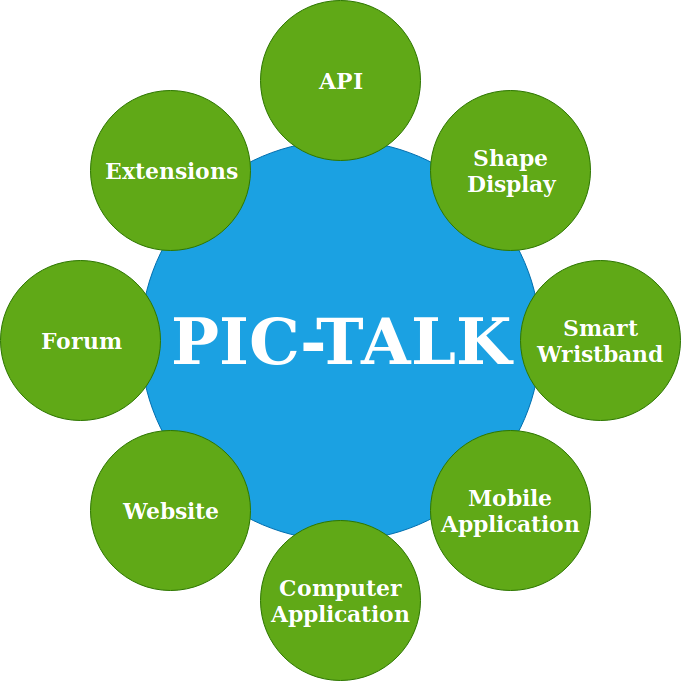
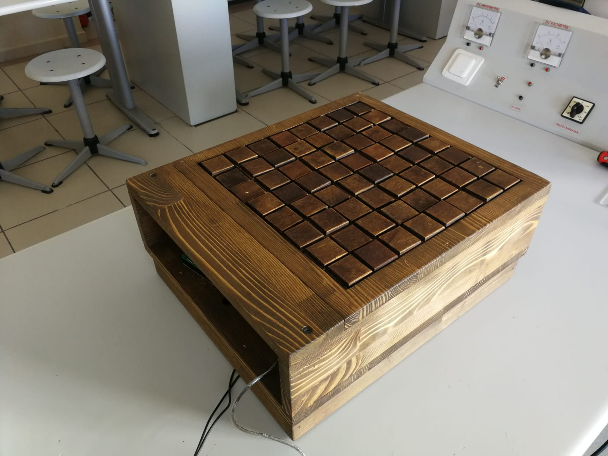

# PICTALK: Creating a Digital Ecosystem that Consists of Open Source Hardware and Software Products for Visually Impaired People

In this study, developing open-source technology and establishing an ecosystem -PIC­-TALK- with the vision of the obliteration of inconveniences in the educational life of visually impaired individuals and contribution to their adaptation to the social life is intended.

## The Goal of The Project
The purpose of our project; it is necessary to remove the difficulties encountered by visually impaired individuals in their educational life and to contribute to social life adaptations. It is to develop an open, integrated technological product for developers and developers.

## WHAT WE ABLE TO DO
- Shape Display: For sensing any shape of anything you want. (8x8)
- Smart-Wristband: For sensing colors and feeling any image from computer or mobile platforms
- Computer & Mobile Application: Learning information about images, reading books, drawing pictures etc.
- Website: Can interact with all the systems and developers can contribute to the community with website. 
    

## OUR MOTIVATION

- This system is the first open-source technology platform in the world for visually impaired individuals.
- It will decrease the cost of the products

## PRODUCTS

### Shape Display

Our purpose is to make 8x8 shape display that illustrates figures or graphs to visually impaired individual. 

LINK =

### Smart Wristband

Our purpose is to make glove that visually impaired individual can feel colors or braille. 

#### Preparing the Glove
The print circuit designs of the project were made using Proteus. The last model is model V1.3.2.

| MATERIALS USED IN  THE SYSTEM| 
| ------------- | 
| Arduino Nano  | 
| 2N2222A   | 
|HC-06 |
|Connector|

##### V1.1.2
|Features   | Known Faults |
| ------------- | ------------- |
|Motor Control  | Size  |
|Bluetooth Connection | Power  |
| | Pin  |

##### V1.1.4
|Features   | Known Faults |
| ------------- | ------------- |
|Motor Control  | Size  |
|Bluetooth Connection | Power  |
|Breakout board||

##### V1.2.1
|Features   | Known Faults |
| ------------- | ------------- |
|Motor Control  | Size  |
|Bluetooth Connection | Power  |
|Mod Switch||

##### V1.3.2
|Features   | Known Faults |
| ------------- | ------------- |
|Motor Control  |  |
|Bluetooth Connection |   |
|Small Size||

### Computer & Mobile Applicatio
Learning information about images, reading books, drawing pictures etc.

#### Drawing Mode
- Lack of Material
- Free Drawing Opportunity

#### Lesson Mode
- Lack of Material 
- Geometrical shapes
- Graphics
- Functions
- Mathematical operations

#### Picture Reading Mode
- Involvement of Voluntary Individuals in the System
- Common Integrated System
- Search by Keyword

#### Library Mode
- Lack of Material
- Book Sharing Platform

### Glove API
An API has been prepared for developers to programmatically program the system. With this API, many functions on the wrist strap are clearly presented to the developers. At the same time, documentation of API is prepared in pic-talk.org site.

## Licence

